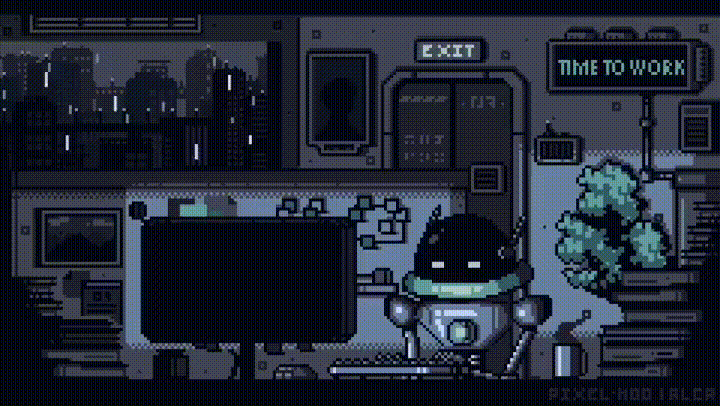

# Hello World!

Hellooooow! Ingrid here – coding, sipping tea, and occasionally debugging my own life. 😄

I kicked off my programming journey in January 2022, diving into Web Development at first. Buuut… along the way, I discovered a love for the C language family (C, C++, and C#), which are my main playgrounds.

I’ve already leveled up with a Bachelor's in Information Technology and completed my cadet training at 42SP. Now, I’m deepening my skills with a specialization at 42 and exploring the cloud universe with AWS. I work with Python in the data world, building products with PySpark and orchestrating ELT pipelines using Terraform in a Data Mesh architecture.

Always curious, always learning, and always looking for the next thing to code (or sip tea over).

 
 
 
 
---

### 👩🏼‍💻 Technologies and tools:

&nbsp;

&nbsp;

&nbsp;

&nbsp;

&nbsp;

&nbsp;

&nbsp;

&nbsp;

&nbsp;

&nbsp;

&nbsp;

&nbsp;

&nbsp;

&nbsp;

&nbsp;

&nbsp;

&nbsp;

&nbsp;

&nbsp;

&nbsp;

&nbsp;

 

---

 

---

 

 

